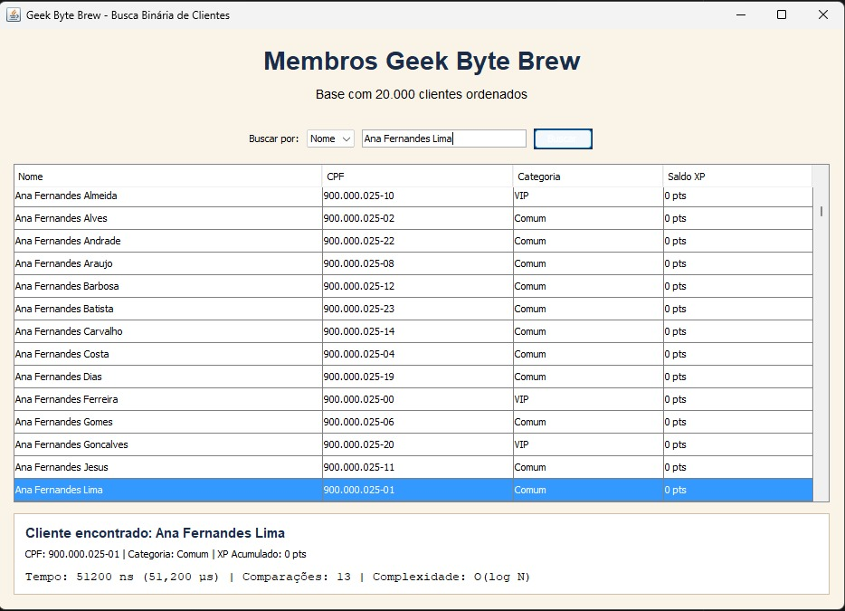
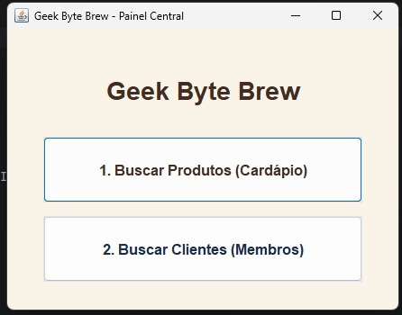

# Geek Byte Brew — Buscas de Produtos e Clientes

## Objetivo do Projeto

O objetivo deste projeto é otimizar o sistema da cafeteria **Geek Byte Brew** por meio de estruturas de dados e algoritmos de busca eficientes. A aplicação mantém produtos e clientes em memória e oferece uma interface gráfica em **Java Swing** para realizar consultas sem depender de interação pelo terminal.

O trabalho foi desenvolvido para o Módulo 1 da disciplina de **Estruturas de Dados 2**.

## Características dos Dados e da Arquitetura

* **Catálogo de produtos:** vetor com 50 produtos previamente ordenados alfabeticamente pelo nome.
* **Busca de produtos:** busca binária iterativa por nome, com complexidade `O(log N)`.
* **Catálogo de clientes:** vetor com 20.000 clientes previamente ordenados alfabeticamente pelo nome.
* **Busca de clientes por nome:** busca binária iterativa, com complexidade `O(log N)`.
* **Busca de clientes por CPF:** tabela hash dimensionada de acordo com a quantidade de registros e com tratamento de colisões, mantendo complexidade média `O(1)`.
* **Métricas de desempenho:** o tempo das buscas é medido com `System.nanoTime()`, e a interface apresenta o tempo e a quantidade de comparações realizadas.
* **Interface gráfica:** telas desenvolvidas em Java Swing para consultar produtos e clientes e visualizar os resultados.
* **Dados em memória:** os catálogos são criados diretamente no código Java, sem necessidade de banco de dados ou arquivo externo.

### Origem da Base de Clientes

A base utilizada pela aplicação possui 20.000 clientes mantidos em memória e pesquisáveis pelo nome ou CPF. Cada nome completo contém um primeiro nome e dois sobrenomes diferentes, selecionados entre os mais frequentes apresentados pelo [Censo 2022 do IBGE](https://censo2022.ibge.gov.br/nomes/rankings). Os registros representam clientes fictícios, e os CPFs são fictícios e únicos, sem utilizar dados pessoais reais.

Depois da geração, todos os clientes são ordenados alfabeticamente pelo nome para permitir a busca binária. A tabela hash é criada com capacidade proporcional à base para evitar excesso de colisões nas consultas por CPF.

## Divisão de Responsabilidades

### Gabriel Ferreira

* Criação do catálogo com 50 produtos ordenados alfabeticamente.
* Implementação manual da busca binária iterativa de produtos por nome.
* Medição do tempo e da quantidade de comparações da busca.
* Desenvolvimento da interface gráfica de consulta de produtos.
* Criação dos testes da busca binária e da tela de produtos.
* Revisão e organização da base de dados de clientes com 20.000 registros.
* Adequação dos nomes dos clientes com base no ranking do Censo 2022 do IBGE.

### Maria Laura Cabral

* Implementação da busca binária de clientes por nome.
* Implementação da tabela hash para busca de clientes por CPF.
* Desenvolvimento da interface gráfica de consulta de clientes.
* Criação dos testes das buscas de clientes.

### Responsabilidade Compartilhada

* Integração das telas no menu principal da cafeteria.
* Revisão, testes e integração das funcionalidades no projeto.

## Como Funcionam as Buscas

### Busca Binária de Produtos

A busca recebe o nome completo de um produto e começa comparando-o com o elemento central do vetor. Se o nome procurado estiver alfabeticamente depois do elemento central, a metade anterior é descartada. Se estiver antes, a metade posterior é descartada. Esse processo se repete até o produto ser encontrado ou o intervalo de busca ficar vazio.

Como o intervalo é dividido pela metade a cada etapa, um catálogo com 50 produtos precisa de, no máximo, aproximadamente 6 comparações. A comparação ignora diferenças entre letras maiúsculas e minúsculas e remove espaços externos do texto informado.

### Busca de Clientes

Os clientes podem ser consultados de duas maneiras:

* **Nome:** busca binária no vetor ordenado de clientes.
* **CPF:** consulta pela tabela hash, utilizando o CPF como chave.

Com 20.000 clientes, a busca binária precisa de no máximo aproximadamente 15 comparações. A tabela hash utiliza o CPF normalizado como chave e trata colisões por encadeamento separado.

## 💻 Como Baixar e Executar

### Pré-requisitos

* JDK 17 ou superior instalado.
* Git instalado apenas se o projeto for clonado pelo GitHub Desktop ou por uma IDE.

### Opção mais simples: baixar pelo navegador

1. Abra o [repositório no GitHub](https://github.com/eda2-2026/G26_EDA2_2026_2).
2. Clique em **Code** e depois em **Download ZIP**.
3. Extraia o arquivo em uma pasta de sua preferência, como `Documentos\Projetos\GeekByteBrew`.
4. Abra a pasta extraída e dê dois cliques no arquivo `executar.bat`.
5. Aguarde a compilação. O painel da cafeteria será aberto automaticamente.

O atalho compila o projeto em uma pasta temporária do Windows e abre somente a interface gráfica. Não é necessário abrir o PowerShell nem manter o projeto em uma pasta específica.

### Clonando com o GitHub Desktop

1. Instale e abra o [GitHub Desktop](https://desktop.github.com/).
2. Escolha **File > Clone repository > URL**.
3. Informe `https://github.com/eda2-2026/G26_EDA2_2026_2.git`.
4. Em **Local path**, escolha uma pasta comum, como `Documentos\Projetos\GeekByteBrew`.
5. Clique em **Clone**.
6. Abra a pasta clonada e dê dois cliques em `executar.bat`.

### Executando pela IDE

1. Abra a pasta do projeto no IntelliJ IDEA, Eclipse ou VS Code.
2. Use o JDK 17 ou superior como SDK do projeto.
3. Configure a pasta `br` da raiz como pasta de código-fonte, se a IDE solicitar.
4. Localize a classe `br.edu.cafeteria.app.Main`.
5. Execute o método `main`.
6. No menu principal, escolha a busca de produtos ou a busca de clientes.

## Executando os Testes

Para executar todos os testes sem digitar comandos, dê dois cliques no arquivo `testar.bat`. A janela exibirá o resultado de cada teste e permanecerá aberta ao final para conferência.

Os testes verificam a ordenação e o tamanho dos catálogos, a unicidade dos CPFs, produtos e clientes encontrados ou inexistentes, posições diferentes dos vetores, tratamento do texto informado, métricas de desempenho e inicialização da interface gráfica.

## 🎥 Demonstração Visual

Ao executar a classe `Main`, o sistema abre o painel central da **Geek Byte Brew**. A partir dele, é possível:

1. Abrir o cardápio e pesquisar um produto pelo nome.
2. Visualizar código, tipo, preço, estoque, tempo e comparações da busca.
3. Abrir o cadastro de membros e pesquisar um cliente pelo nome ou pelo CPF.
4. Comparar as estratégias utilizadas em cada tipo de consulta.

### Capturas de Tela do Sistema

 &nbsp; 
 &nbsp; 
 &nbsp; 

## Equipe de Desenvolvimento

| **Gabriel Ferreira** | **Maria Laura Cabral** |
| :---: | :---: |
|  |  |
| Matrícula: **242004671** | Matrícula: **232005361** |
| [`@diangellis`](https://github.com/diangellis) | [`@Maria-Laura-Regis`](https://github.com/Maria-Laura-Regis) |
